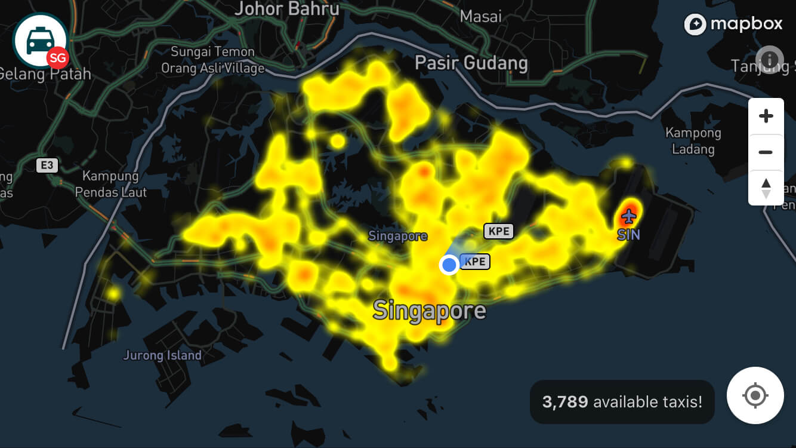

TaxiRouter SG
===



**TaxiRouter SG** is a web app that lets you explore available taxis and taxi stands in Singapore. Period.

It has very little number of features:

- List all taxi stands in Singapore.
- Shows all available taxis in the whole Singapore.
- Tells how many available taxis around you.
- Tells how far is the nearest taxi stand around you.

That's it.

Story
---

This project is [first inspired](https://twitter.com/cheeaun/status/710632610607726592) by [@uzyn](https://github.com/uzyn)'s project: [Singapore Taxi Data Visualization](http://uzyn.github.io/taxisg/). Also following up from his talk on FOSS Asia 2016: [Uncovering of an obfuscated public governmental API ](https://speakerdeck.com/uzyn/uncovering-of-an-obfuscated-public-governmental-api-foss-asia-2016). Later, [Data.gov.sg](https://data.gov.sg/) releases a new [taxi availability API](https://developers.data.gov.sg/transport/taxi-availability) and that marks the beginning of this project.

Technicalities
---

Data is from <https://data.gov.sg/>.

Before `npm i`, install `nss` so that localhost `https` works. Based on [https-localhost](https://github.com/daquinoaldo/https-localhost#dependencies).

- MacOS

  ``` bash
  brew install nss
  ```

- Linux

  ``` bash
  sudo apt install libnss3-tools
      -or-
  sudo yum install nss-tools
      -or-
  sudo pacman -S nss
  ```

Here's a sprinkle of NPM magic:

- `npm i` - install everything
- `npm run taxi-stands` - fetch taxi stands
- `npm run inliner` - inline all assets from `_index.html` to `index.html`
- `npm run watch` - watch files and run `inliner` when files changed
- `npm run serve` - run a local server
- `npm start` - runs both `watch` and `serve`

License
---

Data is copyrighted by the [Land Transport Authority](http://www.lta.gov.sg/).

Everything else [MIT](http://cheeaun.mit-license.org/).
