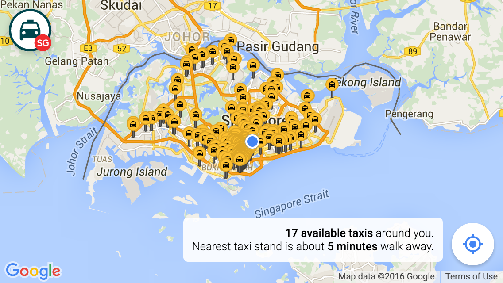

TaxiRouter SG
===

**TaxiRouter SG** is a web app that lets you explore available taxis and taxi stands in Singapore. Period.

It has very little number of features:

- List all taxi stands in Singapore.
- Shows all available taxis in the whole Singapore.
- Tells how many available taxis around you.
- Tells how far is the nearest taxi stand around you.

That's it.

Technicalities
---

Data is from <https://data.gov.sg/>.

Here's a sprinkle of NPM magic:

- `npm i` - install everything
- `npm run taxi-stands` - fetch taxi stands
- `npm run lodash` - generate a custom Lodash build
- `npm run inliner` - inline all assets from `_index.html` to `index.html`
- `npm run watch` - watch files and run `inliner` when files changed
- `npm run serve` - run a local server
- `npm start` - runs both `watch` and `serve`

License
---

Data is copyrighted by the [Land Transport Authority](http://www.lta.gov.sg/).

Everything else [MIT](http://cheeaun.mit-license.org/).
